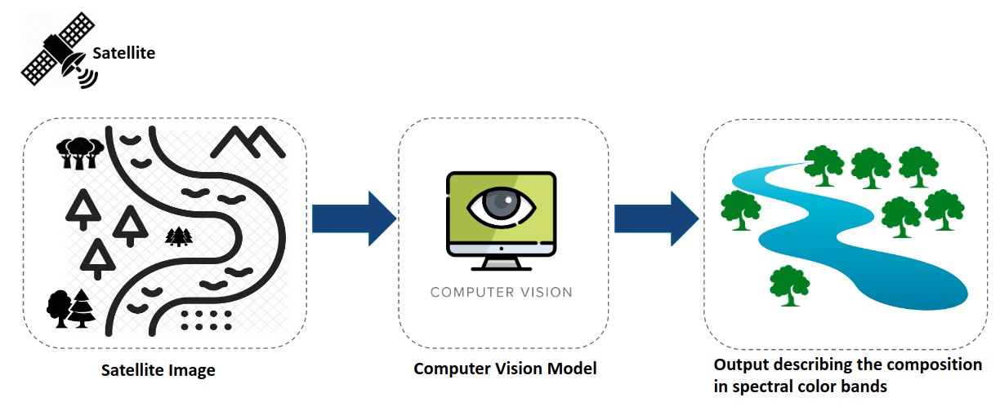
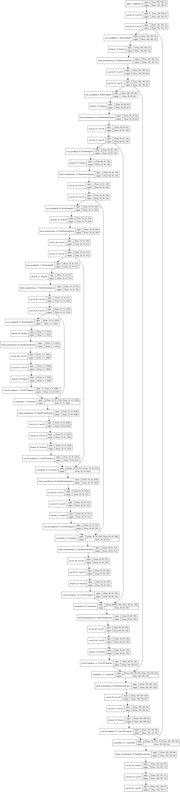
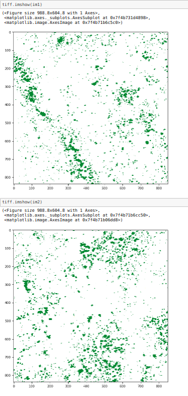
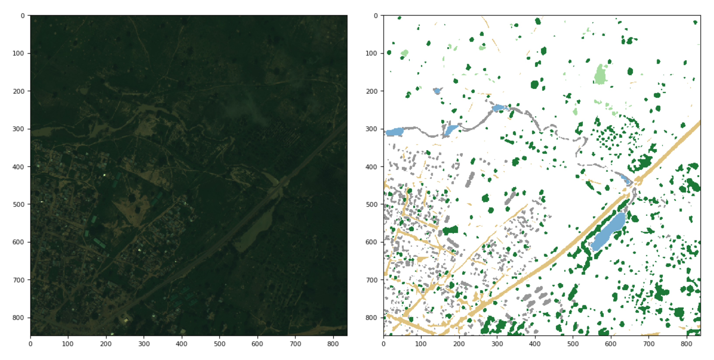
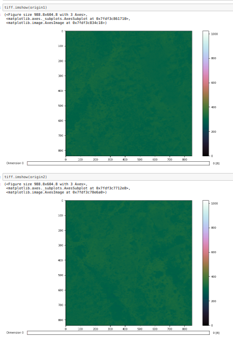

## water-and-forest-cover-surrveillance
This repository contains the code for water and forest cover surveillance. 

### Project Structure
```
├── ckpt_	             # Weight used in prediction
├── images               # Images used in readme.
├── data        	     # Input data for Training and Testing.
├── tensorboard-unet     # Tensorboard-unet.
├── Readme               # Readme for water-and-forest-cover-surrveillance
├── requiremnts          # Requirements file for water-and-forest-cover-surrveillance

```

### System-Design
Propsed system design for water-and-forest-cover-surrveillance  

Identification and ranking of  illegal deforestation and water bodies encroachments 



UNet-based image segmentation to identify water and forest body proportion





### Sample-Input-Output and Result








### In pipeline for water-and-forest-cover-surrveillance

`Inventory of the water bodies & forest cover:` Identifying the locations and size of the water bodies & forests

`Classification of water bodies & forest cover :` Forests with VDF (Very Dense Forest) areas are crucial. These specific bodies need to classified and monitored to prevent any changes

`Preventing Encroachment:` Identifying dumping of construction or urban solid wastes into the tank; identifying illegal urbanisation of forest areas

Some of the water bodies are hydraulically connected to irrigation canals. Status of the connecting channels is to be explored
 
The recent water fillings due to rainfall and channel flow are to be studied. The possibilities of improving the inflow into the water bodies through connections will be studied. Using the land-use patterns, rainfall data and SCS curve number technique, potential of inflow can be estimated


### Reference

1. [Satellite Image Segmentation for Building Detection
using U-net](http://cs229.stanford.edu/proj2017/final-reports/5243715.pdf)

2. [Classification and Segmentation of Satellite
Orthoimagery Using Convolutional Neural Networks](https://www.mdpi.com/2072-4292/8/4/329/pdf)

3. [Dataset-a](https://platform.digitalglobe.com/gbdx/data-sets/)

4. [Dataset-b](http://glcf.umd.edu/data/quickbird/)